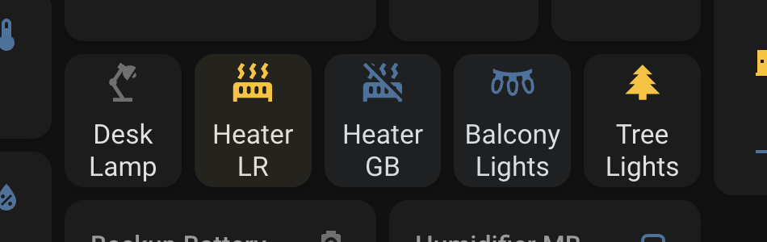

# Govee Smart Heater H7131 Integration for Home Assistant

## Overview

This guide provides step-by-step instructions for integrating the Govee Smart Heater H7131 into Home Assistant using the Govee Developer API.

## Prerequisites

Before you begin, make sure you have the following:

- [Govee Smart Heater H7131](https://www.amazon.com/Govee-Heating-Thermostat-Portable-Electric/dp/B0B2ZMKSGC/)
- Govee Home app ([iOS](https://apps.apple.com/us/app/govee-home/id1395696823), [Android](https://play.google.com/store/apps/details?id=com.govee.home&hl=en_US&gl=US)) with already added device
- Home Assistant installed and running

## Integration Steps

### 1. Obtain Govee Developer API Key

Use the [Apply Govee-API-Key](https://developer.govee.com/reference/apply-you-govee-api-key) instructions to get your API key.

### 2. Get device ID using Govee Developer API

Make a request to the [Govee Developer API](https://govee-public.s3.amazonaws.com/developer-docs/GoveeDeveloperAPIReference.pdf) to get the list of devices, replacing YOUR_GOVEE_API_KEY with the API key obtained in the previous step.

```
curl --location 'https://developer-api.govee.com/v1/appliance/devices' \
--header 'Govee-API-Key: YOUR_GOVEE_API_KEY'
```

```
wget --no-check-certificate --quiet \
  --method GET \
  --timeout=0 \
  --header 'Govee-API-Key: YOUR_GOVEE_API_KEY' \
   'https://developer-api.govee.com/v1/appliance/devices'
```

### 3. Configure Home Assistant

Add lines from configuration.yaml, scripts.yaml and secrets.yaml to your configuration files. You should replace YOUR_GOVEE_API_KEY and DEVICE_ID in these files beforehand.

### 4. Restart Home Assistant

Restart Home Assistant to apply the changes made to the configuration.

### 5. Add a button to the Home Assistant panel



Happy automating! 🏡✨